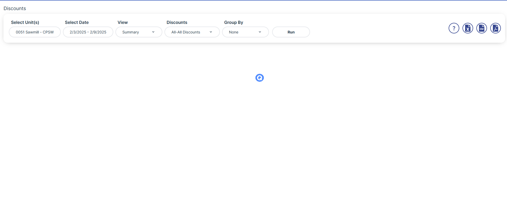

# Sales Analysis System

A powerful web-based platform designed to help businesses gain insights into their sales performance. With comprehensive data analysis and real-time reports, the system enables efficient decision-making to optimize sales strategies, boost profitability, and forecast future trends.

## Key Features

- **Business Summary**: A snapshot of overall business performance, with key metrics at a glance.
- **Daily Sales**: Track sales figures and trends for each day, including totals, comparisons, and insights.
- **Comparable Matrix**: Analyze sales performance across different periods and categories for easy comparison.
- **Discount Tracking**: Understand the impact of discounts on overall sales and profit margins.
- **Hourly Sales**: View sales performance throughout the day with hourly breakdowns.
- **Menu Gross Profit**: See gross profit generated by different menu items and categories.
- **Menu Items Sold**: Track sales quantities for individual menu items, identifying top performers.
- **Period-to-Date Sales**: Access sales data for a specific period, such as weekly, monthly, or quarterly.
- **Prime Cost Scorecard**: Track prime costs and see how they influence overall profitability.
- **Paidouts Report**: Generate reports of payments made to employees or other entities.
- **Sales Chart**: Visualize sales performance through interactive charts and graphs.
- **Sales Forecast**: Project future sales based on historical trends and data.
- **Sales vs Labor**: Compare labor costs with sales figures for better workforce optimization.
- **Sales Summary**: View an overview of total sales and key performance indicators.
- **Speed of Service Report**: Analyze the efficiency of service delivery with time-based reports.
- **Trend Chart**: Track long-term sales trends for better forecasting and strategy development.
- **Trend Report**: Generate detailed reports on sales trends over defined periods.
- **Voids**: Analyze voids and cancellations to better understand and reduce losses.

## Technologies Used

- **Frontend**: React, Redux, TailwindCSS, Bootstrap, JS, TanStack
- **Backend**: .NET
- **Database**: MSSQL
- **State Management**: Redux
- **Real-Time Updates**: Redis
- **API & Component Architecture**: API handler, reusable components, custom hooks
- **File Exports**: ExcelJS, PDFMake, XLSX

## Setup and Installation

### Prerequisites

- Node.js (version >= 16.x)
- .NET (for the backend)

### Clone the repository:

```bash
git clone https://github.com/your-username/sales-analysis-system.git
cd labor-scheduling-management
```
Install dependencies:
```bash
npm install
```
Run the development server:
```bash
npm run dev
```

### Backend Setup
- Install backend dependencies and set up your database configurations.
- Build and run the backend API using .NET CLI or Visual Studio.

### Features Walkthrough
- A detailed walkthrough with tooltips and guided tours for easy navigation and user onboarding. For first-time users, follow the interactive tutorial included in the application.

## 📞 Let's Get Started

Ready to enhance your business with custom tech solutions? Get in touch with us today, and let's discuss how we can help you grow.

📧 Contact us at: ritesh.suri@suretekinfosoft.com  
🌐 Visit our website: https://suretekinfosoft.com   
🔗 Linkedin: [LinkedIn Profile](https://www.linkedin.com/company/suretek-infosoft-pvt--ltd-/posts/?feedView=all)

---

## License

This project is licensed under the **MIT License** - see the [LICENSE](LICENSE) file for details.

## Screenshots

Here are some screenshots of the application in action:




